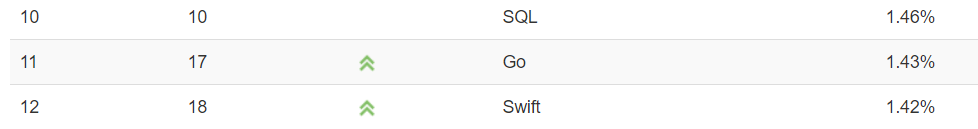
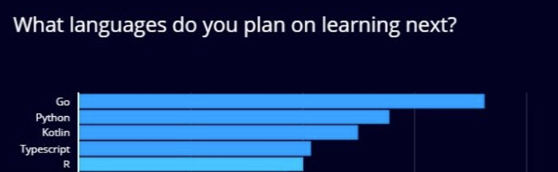
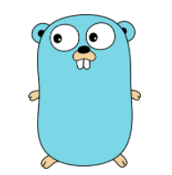

# 🏁 GO LAND 

<!-- 

-->

 
 

Source. [TIOBE Index for August 2020](https://www.tiobe.com/tiobe-index/)

1.43% Rating Go.. SQL보다 점유율이 낮습니다.

 

2%만 사용하는 Go언어.. 황량한 Go 생태계를 위하여 Bolierplate Code를 만들었습니다. 

 

왜냐하면 배우고 싶어하는 사람들이 있으니깐요!

Source. [개발자가 가장 배우고 싶은 프로그래밍 언어는 '고(GO)'](https://zdnet.co.kr/view/?no=20200205112108)

## Repo

- [TODO] Bolierplate-CRUD-Gingonic 
    - Teck Stack: Go(Gingonic), Docker, MySQL, GORM
- [TODO] Bolierplate-JWT-Gingonic 
    - Teck Stack: Go(Gingonic), Docker, MySQL, GORM
- [TODO] Bolierplate-BBS-Gingonic 
    - Teck Stack: Go(Gingonic), Docker, MySQL, GORM
- [TODO] Recomand-StaticAnalysis
- [TODO] Perfomance-Checker

## Contributing

- TBD

 
 
 

fmt.Print("Hello Go!")

Go 세계로 초대합니다.

